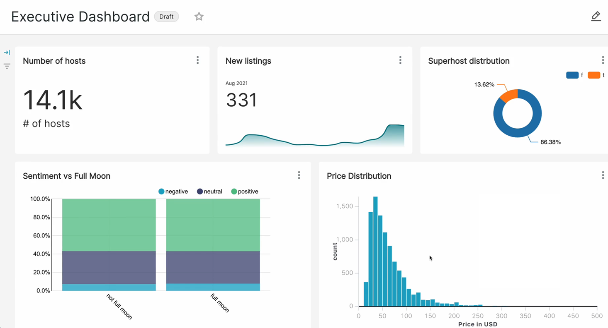
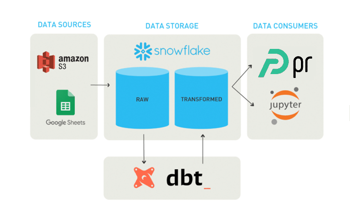
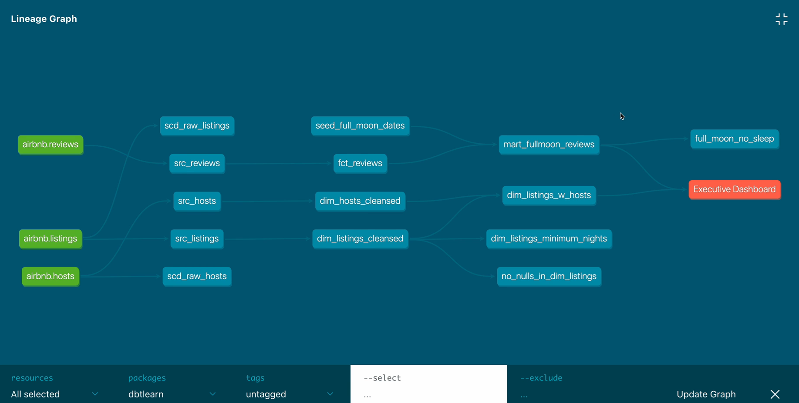

## Analysing Airbnb Berlin 

An end-to-end data project exploring Airbnb listings in Berlin using a Modern Data Stack. The goal is to build a robust data pipeline for transforming, modeling, and visualizing raw data, enabling insights into host behavior, pricing trends, and listing dynamics.

## Modern Data Stack: 

### ❄️ Snowflake
### ⚙️ dbt
### 🐍 Python
### 🧱 SQL
### 📊 Preset

## ✅ Features

### ELT pipeline from raw to cleaned, analytical datasets
### Source freshness and schema testing using dbt
### Dimensional modeling: staging, intermediate, and mart layers
### Dashboard with KPIs, pricing heatmaps, and host analytics

